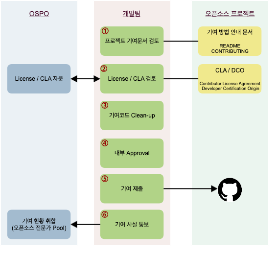

# 오픈소스 기여하기

!!! info
    SK텔레콤은 구성원이 패치 제공 등의 방법으로 외부 오픈소스 프로젝트에 기여하는 것을 적극 권장합니다. 버그를 찾았거나, 코드를 개선했다면 오픈소스 프로젝트에 다시 기여하세요. 다만, 몇 가지 염두해야 할 사항이 있습니다. 흔한 경우는 아니지만 오픈소스 프로젝트와 커뮤니티에 대한 이해와 전략 없이 뛰어들면 실망감만 안겨줄 수 있습니다. 특히, 커뮤니티에서 기업의 명성이 떨어질 뿐만 아니라 법적 위험이 발생할 수도 있습니다.

‌이 가이드는 이러한 법적 문제가 발생하지 않고 오픈소스 커뮤니티와의 효과적인 협업을 안내하기 위해 작성되었으며, SK텔레콤 구성원이 오픈소스 프로젝트에 기여하기 전에 따라야 할 몇 가지 요구 사항과 올바른 기여 방법을 설명합니다. 

## 기여에 앞서

먼저 오픈소스 기여와 관련하여 도움이 될 만한 사항들을 안내합니다. 다음 페이지를 참고하세요. (이미 일반적인 오픈소스 기여에 익숙하다면 이 내용은 스킵하세요.) 

* [__기여해야 하는 이유__][1]
* [__기여 유형__][2]
* [__거버넌스 구조__][3]
* [__좋은 기여자__][4]
* [__프로젝트 확인 방법__][5]

  [1]: why.md
  [2]: type.md
  [3]: governance.md
  [4]: good.md
  [5]: check.md

## 기여 절차와 방법

SK텔레콤 구성원이 회사 업무와 관련된 외부 오픈소스 프로젝트에 코드를 기여할 때 따라야 할 기본 절차는 다음과 같습니다.

### 1. 프로젝트 기여 문서 검토 

사실 오픈소스 프로젝트마다 요구하는 절차가 다릅니다. 

!!! info
    * 프로젝트마다 코딩 스타일, language, formatting, bug/ticket 관리, 릴리즈 시기 등에 대한 다양한 가이드라인을 갖고 있습니다. 
    * 어떤 프로젝트는 Contributor Agreement를 요구하는 반면, 어떤 프로젝트는 Signed-off-by나 다른 형태의 요구를 합니다. 
    * Patch를 받는 방식도 요즘은 대부분 Github의 Pull Request로 받지만, 어떤 프로젝트는 여전히 Mailing List를 이용하기도 합니다.

그렇기 때문에 기여하고자 하는 프로젝트의 프로세스를 제대로 이해하기 위해서는 우선 프로젝트에서 제공하는 문서를 잘 확인해야 합니다. 대개의 프로젝트는 CONTRIBUTING 또는 README 파일로 이러한 문서를 제공합니다. 예를 들어, Kubernetes는 기여자를 위한 자세한 가이드를 제공합니다. ([contributing.md](https://github.com/kubernetes/community/blob/master/contributors/guide/contributing.md) : Kubernetes에 기여하기 위한 가이드) 문서에서 요구하는 사항을 잘 준수할수록 우리의 기여가 수락될 가능성이 커집니다.

### 2. License / CLA 검토

‌어떤 오픈소스 프로젝트는 기여하기 위해서는 먼저 기여자에게 CLA (Contributor License Agreement)에 서명할 것을 요구합니다. 이때 CLA에 임의로 서명하지 마세요. 

오픈소스 프로젝트가 CLA 서명을 요구하는 경우는 SK텔레콤 OSPO(Open Source Program Office)에 검토를 요청하세요. : <U>_Support (오픈소스 관련)_</U>

대부분의 CLA는 서명해도 문제가 되지 않기 때문에 승인 절차가 오래 걸리지 않습니다. 드문 경우지만, CLA에서 지적 재산권을 완전히 양도할 것을 요구하기도 합니다. 이럴 때는 그 CLA에 서명할 수 없습니다. 따라서 그 프로젝트에는 기여할 수 없습니다.‌

### 3. 기여 코드 Clean-up

기여를 제출하기 전에 다음 사항을 한번 확인하세요. ‌

* 기여할 권리가 있는 코드인가요? 직접 작성한 코드라면 문제 되지 않습니다. 만약 기여하려는 코드에 직접 작성하지 않은 코드가 포함되었다면 기여할 권리가 있는지 확인이 필요합니다.
* 회사의 민감하거나 독점적인 정보가 노출될 수 있는 코드를 제공하지 마세요.
* 기여하려는 코드에 특허가 포함되어 있나요? 오픈소스로 기여할 경우 오픈소스 라이선스에 따라 특허를 허여해야 합니다.

이와 같이 확인이 필요한 경우, OSPO(Open Source Program Office)에 문의하세요. ‌: <U>_Support (오픈소스 관련)_</U>

### 4. 개발팀 내부 승인

회사 업무와 관련된 오픈소스 프로젝트에 코드를 기여하기 위해서는 최초 기여 시, 개발팀 내부 의사결정권자에게 승인을 받습니다.

### 5. 기여 제출

이제 프로젝트의 문서에서 요구하는 절차에 따라 기여를 제출합니다. 이때 sk.com 이메일을 사용해서 기여하세요. GitHub에 있는 프로젝트에 기여한다면 다음 페이지를 참고하여 이메일 주소를 설정할 수 있습니다. : [How to associate your commit with a sktelecom.com email](https://help.github.com/articles/setting-your-email-in-git/).‌

일반적인 오픈소스 프로젝트에 기여 제출 방법과 절차는 다음 페이지를 참고하세요. : [__기여 제출 세부 방법__][2]

  [2]: submit.md

### 6. OSPO에 기여 사실 통보

하나의 오픈소스 프로젝트에 최초 기여를 한 후 SK텔레콤 OSPO에 기여 사실을 통보합니다. OSPO에서는 SK텔레콤 구성원이 기여하고 있는 오픈소스 프로젝트 현황을 취합하고 있습니다. 취합 자료는 오픈소스 프로젝트 별 전문가 Pool로 활용하게 됩니다.

OSPO(Open Source Program Office)에 기여 사실을 알려주세요. : <U>_Support (오픈소스 관련)_</U>

