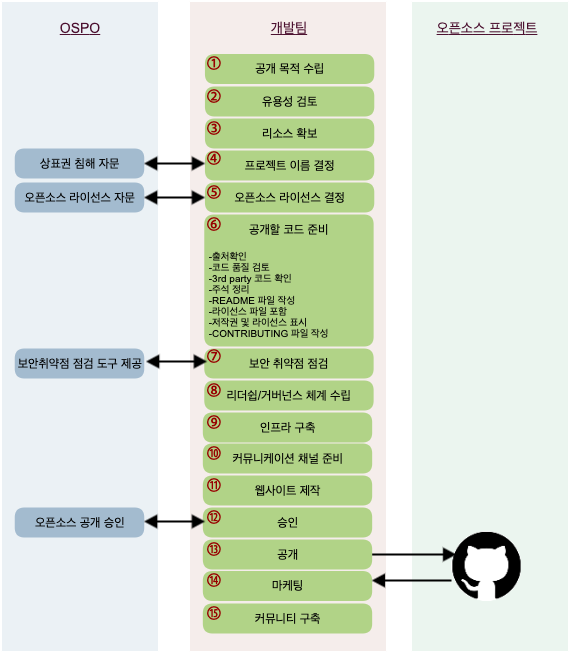

# 오픈소스 공개하기

!!! info
    오픈소스는 소프트웨어 개발 문화를 혁신하고 협업을 통해 가치를 창출하는 훌륭한 도구입니다. 이를 분명히 인식하고 있는 SK텔레콤은 오픈소스 커뮤니티에 참여할 뿐만 아니라 프로젝트를 오픈소스로 공개하여 커뮤니티와 협업하는 것을 적극적으로 지원합니다. 이 문서에서는 SK텔레콤의 소프트웨어를 오픈소스로 공개할때 법적, 윤리적, 기술적인 문제를 유발하지 않고, 오픈소스 협업의 이점을 최대한 활용하기 위한 가이드를 제공합니다.

오픈소스 공개를 위한 주요 절차는 다음과 같습니다.

## 1. 공개 목적 수립

기업이 소프트웨어를 오픈소스로 공개하는 데에는 여러 이유가 있습니다. 어떤 목적으로 프로젝트를 공개를 하려고 하나요? 공개하는 목적이 기업의 비즈니스 전략과 연계되어야 경영진을 이해시킬 수 있습니다.

다음 페이지에서 기업이 일반적으로 오픈소스를 공개하려는 목적을 참고하여 우리 프로젝트의 공개 목적을 수립하세요. 

* [**오픈소스 공개 목적**](why.md)

## 2. 유용성 검토

성공적인 프로젝트가 되기 위해서는 다른 사람들에게도 유용해야 합니다. 만약, 유사한 프로젝트가 이미 존재한다면, 새로운 프로젝트를 만드는 것보다 기존의 프로젝트에 참여하는 게 낫습니다. 경쟁 업체가 추진하는 프로젝트라도 오픈소스에서는 협력하는 것이 중요합니다. 함께 참여하고 협력하면서 모두가 훌륭한 코드를 가질 수 있습니다.

‌단, 더 이상 유용하지 않은 코드인데도 공개만 하면 무조건 커뮤니티가 관리할 것으로 생각해서는 안 됩니다. 오픈소스 커뮤니티는 오래된 코드를 관리해주는 조직이 아닙니다. 실제로 매력적이지 않은 코드를 반복해서 공개한다면 그 회사는 오픈소스 세계에서 신뢰를 잃게 되고, 나중에는 다른 코드를 오픈소스로 공개하여도 개발자는 관심을 두지 않을 것입니다.

우리가 공개하는 오픈소스가 (1) 오픈소스 커뮤니티에 차별화된 가치를 제공하고, (2) 커뮤니티가 해결되지 못했던 문제를 해결하며, (3) 우리의 기술력을 공개함으로 긍정적인 관심을 끌 수 있는 프로젝트가 되기를 바랍니다.

* 우리가 실제 제품이나 서비스에 사용하지 못한 코드라면 오픈소스로도 공개하지 않는 것이 좋습니다. 우리의 제품에도 사용하도록 설득할 수 없다면 다른 사람도 사용하도록 설득하기는 쉽지 않기 때문입니다.
* 또 오픈소스 커뮤니티에서 이미 해결한 문제를 다루는 코드는 공개하지 않습니다. 이런 경우라면, 기존의 오픈소스 프로젝트에 기여하는 것이 좋습니다.

공개하려는 코드가 외부에서도 유용할 수 있다고 판단이 되면 공개 절차를 계속 진행하세요.

## 3. 리소스 확보

개발자를 포함해서 프로젝트에 투입해야 할 리소스를 확보해야 합니다.‌

* 초기에는 일반적인 사내 프로젝트와 비슷한 수준의 개발자가 필요합니다.
* 또한, 외부의 기여를 신속하게 리뷰 할 수 있는 개발자가 필요합니다.
* 그리고, 법무팀, 마케팅팀의 역할도 필요합니다.
* 또한, 프로젝트를 유지, 관리하는데 요구되는 인프라에 대한 예산을 확보해야 합니다. 여기에는 Github와 같은 프로젝트 호스팅을 위한 도구가 포함됩니다.

충분한 리소스가 지원되는 환경을 조성할 수 없다면, 오픈소스로 공개하지 않는 것이 좋습니다.

## 4. 프로젝트 이름 선정

프로젝트가 무엇인지 나타내는데 도움이 되는 이름을 사용하는 것이 좋으며, 문제가 될 소지가 있는 이름은 피해야 합니다.

* [**프로젝트 이름**](name.md)

## 5. 오픈소스 라이선스 선정

소프트웨어를 오픈소스로 공개하기 위해서는 라이선스를 부여해야 합니다. 그래야 다른 사람들도 소프트웨어를 사용, 복사, 수정 및 배포할 수 있습니다. 또한, 라이선스는 법적인 문제로부터 기여자를 보호합니다. 따라서, 오픈소스 프로젝트를 시작할 때 적절한 오픈소스 라이선스를 선택하고 이를 프로젝트에 적용해야 합니다. 

SK텔레콤은 소프트웨어를 오픈소스로 공개 시 기본적으로 [Apache-2.0](http://www.apache.org/licenses/LICENSE-2.0)를 적용하세요. Apache-2.0는 사용자에게 광범위한 자유를 제공하면서 명시적인 특허 허여 조항 등 법적인 관점에서도 잘 작성된 라이선스입니다. 

단, 예외적으로 다음과 같은 경우는 Apache-2.0 외의 라이선스도 적용할 수 있습니다.   

* 커뮤니티에서 주로 사용하는 라이선스가 지정되어 있는 경우도 있습니다. 예를 들어, Node.JS 프로젝트는 MIT 라이선스를 사용합니다. 이때는 해당 라이선스를 적용할 수 있습니다.
* 어떤 프로젝트는 GPL 라이선스의 라이브러리와의 종속성이 있어서 GPL로 공개해야 하는 경우도 있습니다. 이것도 괜찮습니다.

만약, 이외의 다른 라이선스를 선택해야 할 상황이라면 OSPO(Open Source Program Office)에 문의하세요. : <U>_Support (오픈소스 관련)_</U>

!!! info
    참고로, GitHub에서는 오픈소스 공개 시 라이선스 선택에 대한 가이드를 제공하고 있습니다. : [https://choosealicense.com](https://choosealicense.com/)

## 6. 공개할 코드 준비

코드를 공개적으로 배포할 때에는 상당히 주의해야 합니다. 코드 내 모든 주석이 공개하기에 적합한지, 보안 이슈는 없는지 확인하세요. 이 부분은 OSPO의 검토에만 의존하면 안 됩니다. OSPO는 라이선스와 법적인 문제 위주로 검토하지만, 모든 문제를 확인할 수는 없습니다. 

공개할 코드 준비를 위한 세부 사항은 다음 페이지를 참고하세요. 

* [**공개할 코드 준비**](prepare.md)

## 7. 보안 취약점 점검 

공개하려고 하는 코드에 보안 취약점이 있는지 검토하고, 이슈를 해결합니다.

* 오픈소스 보안취약점 점검을 위해 Black Duck을 사용할 수 있습니다. : <U>_Black Duck_</U>

## (Optional : 암호화 컴플라이언스 점검)

오픈소스로 공개하는 프로젝트에 암호화 (cryptographic) 관련 소프트웨어가 포함된다면 수출 규제(Export Control) 컴플라이언스 검토가 필요합니다.

프로젝트가 인증(authentication)이나 디지털 서명(digital signature) 관련 기능만 제공한다면 문의하지 않아도 됩니다. 그러나, 다음과 같은 데이터 암호화(data encryption)를 수행하거나 사용한다면 수출 규제 준수팀에 이를 알리고 적절한 조치를 취하여야 합니다. 

* 암호화 라이브러리 (crypto library) 제공
* https, OpenSSL, OpenVPN 이나 기타 암호화 프로토콜 (encryption protocol)을 이용하여 데이터 암호화 수행

수출 규제 준수팀에 이를 알릴 때에는 다음 정보를 함께 제공합니다. 

* 프로젝트 관리자 이름
* 프로젝트 이름
* 소스 코드를 다운로드 받을 수 있는 URL

## 8. 리더쉽과 거버넌스 체계 수립

거버넌스는 프로젝트가 전략, 릴리스, 방향 및 개발 우선순위에 관한 결정을 내리는 프로세스입니다.

모든 참여자가 프로젝트의 변경 사항을 인식할 수 있도록 의사 결정은 공개적이고 투명해야 합니다. 거버넌스 기구에 참여하기 위해 충족해야 할 기준을 결정하고, 기능 및 버그 추적 방법, 코드 제출 방법 및 릴리스 프로세스 관리에 대한 결정 방법을 수립하세요.

또한, 프로젝트를 시작하기 전에 리더십 역할을 정하는 것도 중요합니다. 여러 기업 참가자와 함께 프로젝트를 시작하는 경우 프로젝트에는 관리 위원회 (Governing Board)와 같은 공식적인 거버넌스 조직이 필요할 수 있습니다.

## 9. 인프라 구축

프로젝트를 위한 저장소를 준비하세요. 많은 프로젝트가 GitHub 또는 GitLab repository를 사용하거나 Gerrit과 같은 도구를 사용하여 자체 저장소를 제공합니다. 

* Bug, issue, feature tracking을 위한 기능도 인프라 계획의 일부로 포함되어야 합니다. 
* 사용자가 이슈 리포트 및 Feature Request를 쉽게 작성할 수 있는 장소를 제공해야 합니다.  
* 그리고, 빌드 자동화, Unit Test 환경을 구축하여 코드를 확인하여 품질을 보장해야 합니다.

## 10. 커뮤니케이션 채널 제공

커뮤니티에서 원활한 커뮤니케이션이 가능하도록 채널을 제공하는 것이 중요합니다. 또한 코드 체크인, 오류 로그 등 기타 작업에 대한 알림을 주는 등 전체 개발 Work Flow에 통합할 수 있는 도구가 필요합니다. 이는 프로젝트를 실시간으로 진행하는 중요한 수단이 됩니다. 

* 우수한 도구 중 하나는 [Slack](https://slack.com/)입니다. Slack은 사용자가 메시지와 파일을 공유하고, Work Flow 구성, 정보 검색 등의 작업을 수행할 수 있게 하는 온라인 프로젝트 관리 및 통신 플랫폼입니다. 그러나 Slack은 상용 도구이며 유지 관리 비용이 발생합니다. 
* 오픈소스로 공개된 도구들로는 IRC, [Gitter.im](https://gitter.im/), [Rocket.Chat ](https://rocket.chat/)등이 있습니다. Rocket.Chat은 오픈소스이며 Slack과 유사한 기능을 제공합니다. 

단, Slack과 같은 타사 서비스에서는 회사의 기밀 정보를 논의해서는 안됩니다. 이러한 커뮤니케이션 채널은 공개 토론으로만 사용해야하며 회사 내부 조직의 논의 도구로는 사용할 수 없습니다. 

## 11. 웹사이트 제작

프로젝트를 위한 회사와 관계없는 중립적인 웹사이트 또는 위키 페이지를 개설하세요. 

웹페이지는 문서, 코드 다운로드 링크 등의 프로젝트에 대한 정보를 커뮤니티에 제공하기 위한 장소입니다. 또한, 웹사이트에서는 프로젝트의 리더십, 거버넌스 세부 사항 등에 대한 내용도 제공할 수 있습니다.

## 12. 승인

아래의 정보와 함께 OSPO(Open Source Program Office)에 승인을 요청하세요. OSPO가 SK텔레콤의 소프트웨어를 오픈소스로 올바르게 공개하고 커뮤니티를 활성화하기 위해 도움을 드리겠습니다. : <U>_Support (오픈소스 관련)_</U>

!!! check
    1. 현재 소스 코드 확인할 수 있는 프로젝트의 Repository 링크 (OSPO 인원이 접근할 수 있도록 권한 부여)
    2. 공개 예정인 저장소 링크 (예: [github.com/](http://github.com/)?)
    3. 적용할 오픈소스 라이선스
    4. 이 프로젝트를 오픈소스로 공개 시 기대할 수 있는 비즈니스 가치는 무엇인가요?
    5. SK텔레콤 구성원이 작성하지 않은 코드가 있나요? 있다면 어느 파일이고, 왜 포함되어야 하는지 알려주세요.
    6. 개발팀 담당 임원으로부터 오픈소스 공개에 대한 승인을 받았나요?
    7. 이 코드가 사용된 제품 혹은 서비스는 무엇인가요? (만약 사용되지 않았다면 그 이유)
    8. 오픈소스 공개 후 지원할 인력이 지정되었나요?
    9. 가이드에 따라 공개 준비가 완료되었나요?
    10. 프로젝트 공개를 알리기 위한 방법은 무엇인가요? (예: Blog post, 콘퍼런스 발표)
    11. 공개하려는 코드와 관련한 특허가 있나요?
    12. 보안 취약점을 검토하고 미비점을 보완하였나요?

한번 공개를 하면 이를 되돌리는 것은 쉽지 않습니다. 그렇기 때문에 가능한 충분한 시간을 갖고 코드를 검토하고 준비하세요. 물론 완벽한 코드를 요구하는 것은 아닙니다. 공개한 후 후회하는 부분이 없도록 실수를 줄여야 합니다.

검토 과정에서 문제가 없다면 승인 과정은 매우 간단하며 신속하게 진행합니다. OSPO는 오픈소스 공개를 막는 것이 아니라 장려하고 돕기 위한 서비스를 제공합니다.

OSPO 승인이 된 후 프로젝트 공개를 진행하세요.

## 13. 공개 

모든 준비와 검토 단계를 마친 후에는 최종적으로 다음 사항을 확인합니다.

* 공개를 위한 Repository에 모든 코드와 문서가 존재하는지 확인하세요.
* 모든 프로젝트 인프라가 실행 중이고, 안전하며, 확장 가능한지 확인하세요.
* 개발자가 커뮤니케이션 채널 (IRC, Mailing List 등)에 참여하고 모니터링할 수 있는지 확인하세요.

그리고, 오픈소스 프로젝트를 런칭합니다. OSPO의 안내에 따라 [https://github.com/sktelecom](https://github.com/sktelecom)에 소스 코드 저장소를 Public하게 공개하세요. 

## 14. 마케팅 

프로젝트를 계속 진행하기 위해서는 마케팅이 필수적입니다. 마케팅에는 프로젝트 홍보, 성공적인 운영 전략 수립, 현실적인 예산 및 프로젝트 브랜딩 제공, 소셜 미디어 계정 활성화 등 장기적인 성공을 위한 활동 등이 포함됩니다. 여기에서는 프로젝트를 공개하고 이를 알리기 위한 몇가지 방법을 안내합니다.

1. 프로젝트와 관련이 있는 커뮤니티의 메일링 리스트나 포럼에 프로젝트가 공개되었음을 알립니다.
2. SK텔레콤 기술 블로그([https://sktelecom.github.io/](https://sktelecom.github.io/))에 프로젝트에 대해 소개합니다. 
3. 프로젝트의 소셜 미디어(Twitter, Facebook, LinkedIn 등)를 통해 홍보합니다. SK텔레콤의 소셜 미디어 계정을 활용할 수도 있습니다. 
4. 프로젝트와 관련이 있는 오픈소스 컨퍼런스에서 주제 발표를 합니다.

## 15. 커뮤니티 구축 

이제 프로젝트를 홍보하고 사람들에게 프로젝트를 사용할 수 있도록 알리는 것은 우리의 임무입니다. 얼마나 많은 사람이 프로젝트에 참여하여 코드를 사용하고, 버그를 수정하고, 문제를 보고하는지에 따라 프로젝트의 성공을 판단할 수 있습니다. 

* 커뮤니티 구축은 자동으로 이루어지지 않습니다. 커뮤니티 구축을 위한 세부 활동은 다음 페이지를 참고하세요. : (커뮤니티 활성화 페이지는 준비 중 : [haksung@sk.com](mailto:haksung@sk.com) )
* 또한, 이를 위해 프로젝트를 측정할 수 있어야 합니다. 측정 지표와 측정 방법에 대한 세부 내용은 다음 페이지를 참고하세요. : (오픈소스 측정 페이지는 준비 중 : [haksung@sk.com](mailto:haksung@sk.com) )

